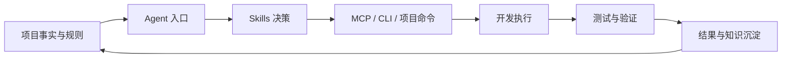

# AI Agent 研发工程化索引

将零散的 AI 编程工具使用方式沉淀为可复用、可维护的研发体系，使 OpenCode、Codex、Claude Code 等 Agent 能稳定完成项目理解、任务拆解、工具选择、开发执行、验证安排和结果沉淀。

## 核心目标

- **准确性**：事实来自源码、配置和清单，不依赖陈旧提示词。
- **可控性**：团队规则、个人工具和敏感配置边界清晰。
- **效率**：按变更风险选择最小验证，不机械运行全套工具。
- **可复用性**：把判断方法沉淀为 Skills，把外部能力封装为 MCP。
- **可维护性**：每类事实只有一个权威来源，入口文件只负责路由。
- **可审计性**：每次任务能说明修改、验证、未覆盖风险和知识去向。

## 体系地图

## 阅读路径

1. [[01-体系架构/01-总体架构与分层|总体架构与分层]]
2. [[01-体系架构/02-个人与团队隔离|个人与团队隔离]]
3. [[01-体系架构/03-全局工具能力地图|全局工具能力地图]]
4. [[02-项目规则/01-项目规则文档分层|项目规则文档分层]]
5. [[02-项目规则/02-AGENTS与CLAUDE入口设计|AGENTS 与 CLAUDE 入口设计]]
6. [[03-Skills/01-Skill设计与触发治理|Skill 设计与触发治理]]
7. [[03-Skills/02-全局Skill能力索引|全局 Skill 能力索引]]
8. [[04-MCP/01-MCP能力与使用门禁|MCP 能力与使用门禁]]
9. [[04-MCP/02-浏览器与接口工具分工|浏览器与接口工具分工]]
10. [[04-MCP/03-全局MCP能力索引|全局 MCP 能力索引]]
11. [[05-开发工作流/01-Agent开发闭环|Agent 开发闭环]]
12. [[05-开发工作流/02-全局CLI与本地工具链|全局 CLI 与本地工具链]]
13. [[05-开发工作流/03-工具选择路由|工具选择路由]]
14. [[06-测试决策/01-变更驱动的测试决策|变更驱动的测试决策]]
15. [[06-测试决策/02-无CI场景的验证策略|无 CI 场景的验证策略]]
16. [[07-上下文管理/01-上下文分层与减法|上下文分层与减法]]
17. [[08-知识沉淀/01-工程知识沉淀闭环|工程知识沉淀闭环]]
18. [[09-治理与演进/01-成熟度模型与演进路线|成熟度模型与演进路线]]

## 相关通用工程知识

- [[../软件工程/03-交付与质量/01-CI触发方式|CI 触发方式]]

## 可复用模板

- [[模板/AI-Agent项目接入检查清单|AI Agent 项目接入检查清单]]
- [[模板/Skill设计模板|Skill 设计模板]]
- [[模板/Agent验证报告模板|Agent 验证报告模板]]

## 总原则

> 规则约束边界，Skills 承载判断，MCP 提供能力，项目命令保证可重复执行，知识库保存可迁移的方法论。
