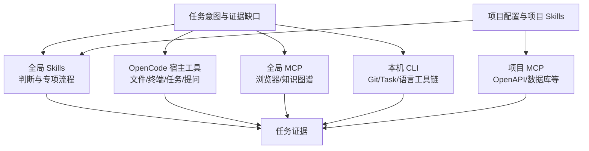

# 全局工具能力地图

全局工具层保存跨项目可复用的能力、触发条件和边界。项目知识只记录该项目启用了哪些能力以及特殊约束，不重复全局说明。

## 分层

## 能力入口

| 类型 | 说明 | 详细索引 |
|---|---|---|
| 全局 Skills | 跨项目的文档、浏览器、Skill/MCP 构建与方案澄清能力 | [[../03-Skills/02-全局Skill能力索引|全局 Skill 能力索引]] |
| 全局 MCP | 跨项目的 Chrome DevTools 和 Memory 知识图谱能力 | [[../04-MCP/03-全局MCP能力索引|全局 MCP 能力索引]] |
| OpenCode 宿主工具 | Glob、Grep、Read、Apply Patch、Task、Question、Web Fetch 等 | [[../05-开发工作流/03-工具选择路由|工具选择路由]] |
| 本机 CLI | Java、Maven、Node、Task、Playwright、Python、Git、Bash、PowerShell | [[../05-开发工作流/02-全局CLI与本地工具链|全局 CLI 与本地工具链]] |
| 项目扩展 | 项目 Skills、项目 MCP、Taskfile 和项目专有规则 | 各项目工程架构，例如 [[工作/cssz/house-platform-backend/00-项目工程架构|house-platform-backend 工程架构]] |

## 权威来源

| 信息 | 权威来源 |
|---|---|
| 当前会话可加载的 Skills | Agent 运行时提供的 `available_skills` |
| Skill 内容与脚本 | 对应 Skill 目录 |
| 当前会话可调用的 MCP 工具 | Agent 运行时工具清单 |
| 全局 OpenCode 配置 | 用户级 OpenCode 配置目录；知识库不复制敏感配置 |
| 本机工具路径和已验证版本 | 用户级 `ENVIRONMENT.md` |
| 项目启用能力 | 项目 `opencode.json`、项目 Skills、`Taskfile.yml` 和项目文档 |

全局配置目录可能受 Agent 权限策略保护。无法直接读取时，只记录运行时已经公开并验证的能力，不推测隐藏配置。

## 边界

- 全局层记录可迁移的能力与选择原则。
- 项目层记录业务语义、source 映射、数据库边界和项目命令。
- 机器层记录绝对路径、环境变量和版本。
- 凭据层不进入知识库，只进入环境变量或安全存储。

## 维护

- 新增或删除全局 Skill/MCP/CLI 后更新对应索引和本页 `updated`。
- 工具版本变化只更新 `ENVIRONMENT.md`；只有能力或兼容边界变化时才更新知识库。
- 项目工具从本页建立引用，不把项目专有配置提升为全局事实。
