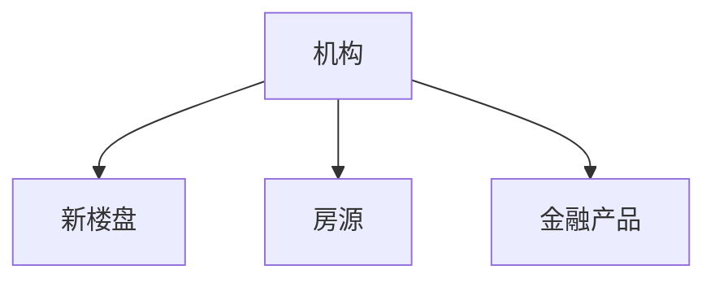
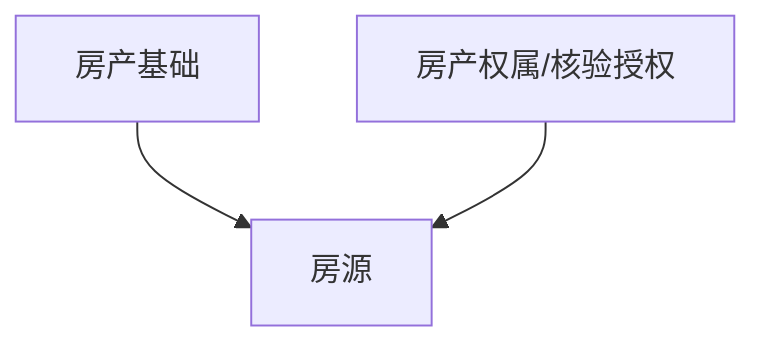

# DB总关联关系

## 机构业务挂载

## 房源依赖关系

## 业务域职责

| 业务域 | 核心表 | 说明 |
|---|---|---|
| 机构域 | `INSTITUTION_BASE`、`INSTITUTION_DEVELOPER`、`INSTITUTION_AGENCY`、`INSTITUTION_FINANCIAL`、`INSTITUTION_USER`、`INSTITUTION_USER_ROLE` | 机构主数据、机构类型扩展、机构员工关系 |
| 新楼盘域 | `PROPERTY_NEW_PROJECT`、`PROPERTY_NEW_BUILDING`、`PROPERTY_NEW_LAYOUT`、`NEW_BUILDING_LAYOUT`、`NEW_PROJECT_*` | 新房项目聚合根及其子资源 |
| 房源域 | `PROPERTY_HOUSE_LISTING`、`PROPERTY_LISTING_ALBUM`、`PROPERTY_LISTING_LAYOUT`、`PROPERTY_SURROUNDING` | 二手房和租房发布数据 |
| 房产基础域 | `PROPERTY_COMMUNITY`、`PROPERTY_BUILDING`、`PROPERTY_UNIT` | 小区、楼栋、房号基础数据 |
| 房产权属/核验授权域 | `PROPERTY_OWNERSHIP`、`PROPERTY_VERIFICATION`、`PROPERTY_AUTHORIZATION` | 房产/权属基础信息、房源核验、委托授权；`PROPERTY_OWNERSHIP` 数据来源第三方，当前未对接 |
| 金融产品域 | `FIN_LOAN_PRODUCT` | 金融机构发布的贷款产品 |

## 总关系口径

| 来源域     | 目标域     | 主要字段                                                                                                             |
| ------- | ------- | ---------------------------------------------------------------------------------------------------------------- |
| 机构域     | 新楼盘域    | `PROPERTY_NEW_PROJECT.DEVELOPER_ID`                                                                              |
| 机构域     | 房源域     | `PROPERTY_HOUSE_LISTING.INSTITUTION_ID`、`PROPERTY_HOUSE_LISTING.PUBLISHER_INSTITUTION_USER_ID`                   |
| 机构域     | 金融产品域   | `FIN_LOAN_PRODUCT.INST_ID`                                                                                       |
| 房产基础域   | 房源域     | `PROPERTY_HOUSE_LISTING.COMMUNITY_ID`                                                                            |
| 房产基础域   | 房产权属/核验授权域 | `PROPERTY_AUTHORIZATION.PROPERTY_UNIT_ID`                                                                        |
| 房产权属/核验授权域 | 房源域     | `PROPERTY_VERIFICATION.HOUSE_ID`、`PROPERTY_HOUSE_LISTING.AUTHORIZATION_ID`、`PROPERTY_HOUSE_LISTING.OWNERSHIP_ID` |

## 约束说明

当前核心业务表多数没有数据库外键约束，关系主要通过字段命名、字段注释、索引和数据写入逻辑维护。DB 梳理时应把“字段语义关系”和“数据库强约束”分开看。
