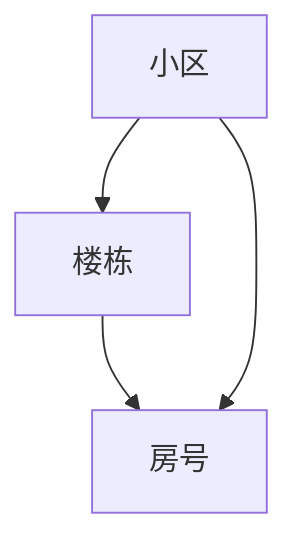

# DB模块关系-房产基础

## 模块图

## 表关系

| 表 | 说明 | 关键字段 | 关系 |
|---|---|---|---|
| `PROPERTY_COMMUNITY` | 小区基础信息表 | `ID` | 小区聚合根 |
| `PROPERTY_BUILDING` | 楼栋信息表 | `COMMUNITY_ID` | `COMMUNITY_ID -> PROPERTY_COMMUNITY.ID` |
| `PROPERTY_UNIT` | 单元/房号信息表 | `BUILDING_ID`、`COMMUNITY_ID` | `BUILDING_ID -> PROPERTY_BUILDING.ID`，`COMMUNITY_ID -> PROPERTY_COMMUNITY.ID` |

## 字段摘要

| 表 | 重要字段 |
|---|---|
| `PROPERTY_COMMUNITY` | `NAME`、`ADDRESS`、`DISTRICT`、`BLOCK`、`LONGITUDE`、`LATITUDE`、`BUILD_YEAR`、`DEVELOPER`、`TOTAL_BUILDINGS`、`TOTAL_UNITS`、`PROPERTY_COMPANY_ID`、`PROPERTY_FEE`、`STATUS` |
| `PROPERTY_BUILDING` | `COMMUNITY_ID`、`BUILDING_NO`、`TOTAL_FLOORS`、`ELEVATORS`、`BUILD_YEAR`、`LAYOUT_DISTRIBUTION` |
| `PROPERTY_UNIT` | `BUILDING_ID`、`COMMUNITY_ID`、`ROOM_NO`、`FLOOR`、`AREA`、`INNER_AREA`、`LAYOUT`、`ORIENTATION`、`USAGE_TYPE`、`VERIFY_STATUS`、`MORTGAGE_STATUS`、`SEAL_STATUS` |

## 索引摘录

| 表                    | 索引                    | 字段             |
| -------------------- | --------------------- | -------------- |
| `PROPERTY_COMMUNITY` | `IDX_PC_NAME`         | `NAME`         |
| `PROPERTY_COMMUNITY` | `IDX_PC_DISTRICT`     | `DISTRICT`     |
| `PROPERTY_BUILDING`  | `IDX_PB_COMMUNITY_ID` | `COMMUNITY_ID` |
| `PROPERTY_UNIT`      | `IDX_PU_BUILDING_ID`  | `BUILDING_ID`  |
| `PROPERTY_UNIT`      | `IDX_PU_COMMUNITY_ID` | `COMMUNITY_ID` |
