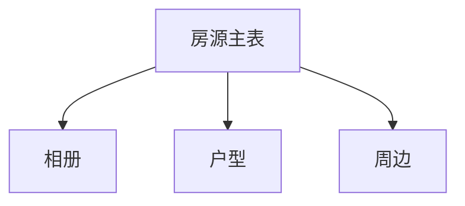

# DB模块关系-房源

## 模块图

## 共表口径

`PROPERTY_HOUSE_LISTING` 是二手房和租房共用主表，通过 `HOUSE_TYPE` 区分：

| `HOUSE_TYPE` | 含义 |
|---|---|
| `second_hand` | 二手房 |
| `rental` | 租房 |
| `new_home` | 新房字典值；新房主结构独立由 `PROPERTY_NEW_PROJECT` 承载 |

## 表关系

| 表 | 说明 | 关键字段 | 关系 |
|---|---|---|---|
| `PROPERTY_HOUSE_LISTING` | 二手房/租房统一房源主表 | `ID`、`HOUSE_TYPE`、`COMMUNITY_ID` | 房源聚合根 |
| `PROPERTY_LISTING_ALBUM` | 房源相册表 | `LISTING_ID` | `LISTING_ID -> PROPERTY_HOUSE_LISTING.ID` |
| `PROPERTY_LISTING_LAYOUT` | 房源户型表 | `LISTING_ID`、`BUILDING_ID` | `LISTING_ID -> PROPERTY_HOUSE_LISTING.ID`，可选 `BUILDING_ID -> PROPERTY_BUILDING.ID` |
| `PROPERTY_SURROUNDING` | 房源周边配套表 | `LISTING_ID` | `LISTING_ID -> PROPERTY_HOUSE_LISTING.ID` |

## `PROPERTY_HOUSE_LISTING` 字段分区

| 分区 | 字段 |
|---|---|
| 类型与来源 | `HOUSE_TYPE`、`SOURCE_TYPE` |
| 发布主体 | `PUBLISHER_ID`、`INSTITUTION_ID`、`PUBLISHER_INSTITUTION_USER_ID` |
| 位置 | `COMMUNITY_ID`、`DISTRICT`、`ADDRESS`、`LONGITUDE`、`LATITUDE` |
| 状态 | `STATUS`、`AUDIT_STATUS`、`AUDIT_REMARK`、`AUDITOR_ID`、`AUDIT_TIME`、`SALE_STATUS` |
| 核验与权属 | `VERIFY_STATUS`、`VERIFY_NO`、`VERIFIED_TIME`、`AUTHORIZATION_ID`、`OWNERSHIP_ID` |
| 二手房价格 | `TOTAL_PRICE`、`UNIT_PRICE`、`REFERENCE_DOWN_PAYMENT`、`REFERENCE_MONTHLY_PAYMENT` |
| 二手房权属 | `PROPERTY_RIGHTS`、`OWNERSHIP_TYPE`、`IS_MORTGAGED`、`PROPERTY_USAGE`、`HOLDING_YEARS`、`PROPERTY_BELONG`、`OWNERSHIP_STATUS` |
| 租房价格 | `RENT_PRICE`、`DEPOSIT_TYPE`、`PAYMENT_CYCLE` |
| 租赁条款 | `MIN_LEASE_TERM`、`MAX_LEASE_TERM`、`IS_SHARED`、`RENTAL_TYPE`、`AVAILABLE_DATE` |
| 图片与描述 | `COVER_URL`、`IMAGES`、`HOUSE_IMAGES`、`OUTDOOR_IMAGES`、`DESCRIPTION`、`TAGS`、`HIGHLIGHTS`、`LAYOUT_DESC` |

## 索引摘录

| 表 | 索引 | 字段 |
|---|---|---|
| `PROPERTY_HOUSE_LISTING` | `IDX_PHL_COMMUNITY` | `COMMUNITY_ID` |
| `PROPERTY_HOUSE_LISTING` | `IDX_PHL_PUBLISHER` | `PUBLISHER_ID` |
| `PROPERTY_HOUSE_LISTING` | `IDX_HOUSE_LISTING_PUBLISHER_INST_USER` | `PUBLISHER_INSTITUTION_USER_ID` |
| `PROPERTY_HOUSE_LISTING` | `IDX_PHL_OWNERSHIP` | `OWNERSHIP_ID` |
| `PROPERTY_HOUSE_LISTING` | `IDX_PHL_STATUS` | `STATUS` |
| `PROPERTY_LISTING_ALBUM` | 主键索引 | `ID` |
| `PROPERTY_LISTING_LAYOUT` | 主键索引 | `ID` |
