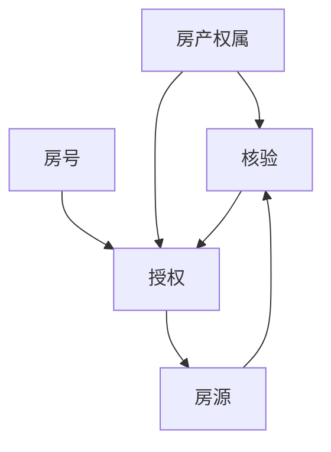

# DB模块关系-房产权属核验授权

## 模块图

## 表关系

| 表                        | 说明                     | 关键字段                                                                                               | 关系                                                                              |
| ------------------------ | ---------------------- | -------------------------------------------------------------------------------------------------- | ------------------------------------------------------------------------------- |
| `PROPERTY_OWNERSHIP`     | 房产/权属基础表，数据来源第三方，当前未对接 | `ID`、`USER_ID`、`CERT_NO_HASH`、`BDCDYH`、`FWZL`                                                      | 第三方房产权属数据落库载体                                                                   |
| `PROPERTY_VERIFICATION`  | 房源核验记录表                | `HOUSE_ID`、`OWNERSHIP_ID`                                                                          | `HOUSE_ID -> PROPERTY_HOUSE_LISTING.ID`，`OWNERSHIP_ID -> PROPERTY_OWNERSHIP.ID` |
| `PROPERTY_AUTHORIZATION` | 委托授权书表                 | `PROPERTY_UNIT_ID`、`LANDLORD_ID`、`INSTITUTION_ID`、`AGENT_USER_ID`、`VERIFICATION_ID`、`OWNERSHIP_ID` | 连接房号、房东、机构、经纪人、核验和权属                                                            |
| `PROPERTY_HOUSE_LISTING` | 房源主表                   | `AUTHORIZATION_ID`、`OWNERSHIP_ID`、`VERIFY_NO`、`VERIFIED_TIME`                                      | 反向保存授权和权属关系                                                                     |
| `PROPERTY_UNIT`          | 房号表                    | `ID`                                                                                               | 可被授权记录引用                                                                        |

## 链路说明

- `PROPERTY_OWNERSHIP` 是房产/权属基础表，设计用于保存第三方提供的登记编号、不动产单元号、房屋坐落、权利人、权证号、权属状态等数据；当前第三方数据尚未对接。
- `PROPERTY_VERIFICATION` 针对房源生成核验记录，并可绑定权属记录。
- `PROPERTY_AUTHORIZATION` 表达房东对机构或经纪人的委托授权，并可绑定房号、核验记录和权属记录。
- `PROPERTY_HOUSE_LISTING` 通过 `AUTHORIZATION_ID`、`OWNERSHIP_ID`、`VERIFY_NO` 等字段接入核验授权结果。

## 索引摘录

| 表 | 索引 | 字段 |
|---|---|---|
| `PROPERTY_OWNERSHIP` | `IDX_PO_USER_ID` | `USER_ID` |
| `PROPERTY_OWNERSHIP` | `IDX_PO_CERT_NO_HASH` | `CERT_NO_HASH` |
| `PROPERTY_OWNERSHIP` | `IDX_PO_COMMUNITY` | `COMMUNITY_NAME` |
| `PROPERTY_VERIFICATION` | `IDX_PV_HOUSE_ID` | `HOUSE_ID` |
| `PROPERTY_VERIFICATION` | `IDX_PV_OWNERSHIP` | `OWNERSHIP_ID` |
| `PROPERTY_VERIFICATION` | `IDX_PV_STATUS` | `VERIFY_STATUS` |
| `PROPERTY_AUTHORIZATION` | `IDX_AUTH_UNIT` | `PROPERTY_UNIT_ID` |
| `PROPERTY_AUTHORIZATION` | `IDX_AUTH_INSTITUTION` | `INSTITUTION_ID` |
| `PROPERTY_AUTHORIZATION` | `IDX_AUTH_AGENT` | `AGENT_USER_ID` |
| `PROPERTY_AUTHORIZATION` | `IDX_PA_OWNERSHIP` | `OWNERSHIP_ID` |

## 关系风险

这些表的关系主要靠业务字段维护，当前数据库约束查询未看到显式外键。写入和修复数据时需要主动校验引用 ID 是否存在。
