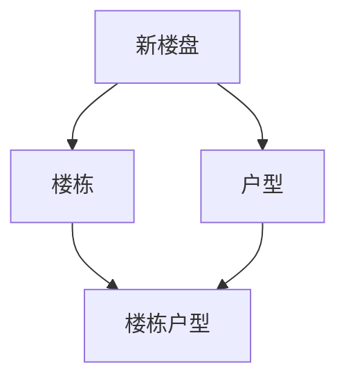
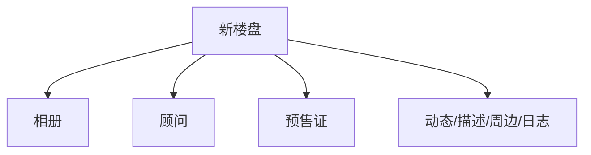

# DB模块关系-新楼盘

## 主链路图

## 附属信息图

## 表关系

| 表 | 说明 | 关键字段 | 关系 |
|---|---|---|---|
| `PROPERTY_NEW_PROJECT` | 新房楼盘项目主表 | `ID`、`DEVELOPER_ID` | 新楼盘聚合根 |
| `PROPERTY_NEW_BUILDING` | 新房楼栋表 | `PROJECT_ID`、`PERMIT_ID` | `PROJECT_ID -> PROPERTY_NEW_PROJECT.ID`，`PERMIT_ID -> NEW_PROJECT_PRESALE_PERMIT.ID` |
| `PROPERTY_NEW_LAYOUT` | 新房户型表 | `PROJECT_ID` | `PROJECT_ID -> PROPERTY_NEW_PROJECT.ID` |
| `NEW_BUILDING_LAYOUT` | 新房楼栋户型关联表 | `BUILDING_ID`、`LAYOUT_ID` | `BUILDING_ID -> PROPERTY_NEW_BUILDING.ID`，`LAYOUT_ID -> PROPERTY_NEW_LAYOUT.ID` |
| `NEW_PROJECT_ALBUM` | 新房项目相册表 | `PROJECT_ID` | `PROJECT_ID -> PROPERTY_NEW_PROJECT.ID` |
| `NEW_PROJECT_CONSULTANT` | 新房置业顾问表 | `PROJECT_ID`、`INSTITUTION_USER_ID` | `PROJECT_ID -> PROPERTY_NEW_PROJECT.ID`，`INSTITUTION_USER_ID -> INSTITUTION_USER.ID` |
| `NEW_PROJECT_PRESALE_PERMIT` | 新房预售许可证表 | `PROJECT_ID` | `PROJECT_ID -> PROPERTY_NEW_PROJECT.ID` |
| `NEW_PROJECT_NEWS` | 新房楼盘动态表 | `PROJECT_ID` | `PROJECT_ID -> PROPERTY_NEW_PROJECT.ID` |
| `NEW_PROJECT_DESCRIPTION` | 新房项目分段描述表 | `PROJECT_ID` | `PROJECT_ID -> PROPERTY_NEW_PROJECT.ID` |
| `NEW_PROJECT_SURROUNDING` | 新房周边配套表 | `PROJECT_ID` | `PROJECT_ID -> PROPERTY_NEW_PROJECT.ID` |
| `NEW_PROJECT_OPERATION_LOG` | 新房项目操作日志表 | `PROJECT_ID` | `PROJECT_ID -> PROPERTY_NEW_PROJECT.ID` |
| `PROPERTY_ARTICLE` | 房产资讯文章表 | `PROJECT_ID` | 可选关联 `PROPERTY_NEW_PROJECT.ID` |

## 索引摘录

| 表 | 索引 | 字段 |
|---|---|---|
| `PROPERTY_NEW_BUILDING` | `IDX_NEW_BUILDING_PROJECT` | `PROJECT_ID` |
| `PROPERTY_NEW_LAYOUT` | `IDX_NEW_LAYOUT_PROJECT` | `PROJECT_ID` |
| `NEW_BUILDING_LAYOUT` | `IDX_BL_BUILDING` | `BUILDING_ID` |
| `NEW_BUILDING_LAYOUT` | `IDX_BL_LAYOUT` | `LAYOUT_ID` |
| `NEW_PROJECT_ALBUM` | `IDX_ALBUM_PROJECT` | `PROJECT_ID` |
| `NEW_PROJECT_CONSULTANT` | `IDX_CONSULTANT_PROJECT` | `PROJECT_ID` |
| `NEW_PROJECT_CONSULTANT` | `IDX_NEW_CONSULTANT_INST_USER` | `INSTITUTION_USER_ID` |
| `NEW_PROJECT_PRESALE_PERMIT` | `IDX_PERMIT_PROJECT` | `PROJECT_ID` |
