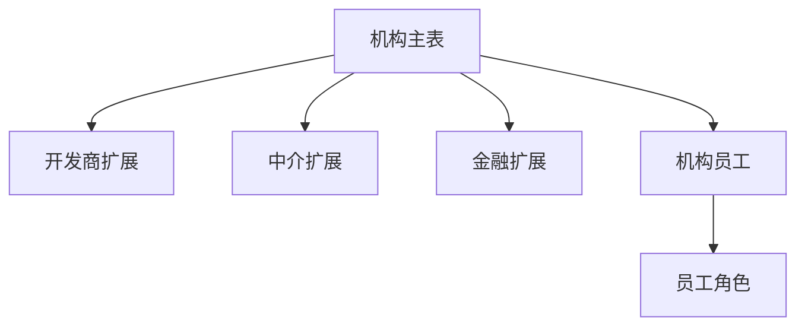

# DB模块关系-机构

## 模块图

## 表关系

| 表 | 说明 | 关键字段 | 关系 |
|---|---|---|---|
| `INSTITUTION_BASE` | 机构主表 | `ID`、`TYPE`、`STATUS`、`AUDIT_STATUS`、`PARENT_ID` | 机构聚合根 |
| `INSTITUTION_DEVELOPER` | 开发企业扩展子表 | `INSTITUTION_ID` | `INSTITUTION_ID -> INSTITUTION_BASE.ID` |
| `INSTITUTION_AGENCY` | 中介机构扩展子表 | `INSTITUTION_ID` | `INSTITUTION_ID -> INSTITUTION_BASE.ID` |
| `INSTITUTION_FINANCIAL` | 金融机构扩展子表 | `INSTITUTION_ID` | `INSTITUTION_ID -> INSTITUTION_BASE.ID` |
| `INSTITUTION_USER` | 用户-机构关系表 | `INSTITUTION_ID`、`USER_ID` | `INSTITUTION_ID -> INSTITUTION_BASE.ID`，`USER_ID -> SYS_USER.ID` |
| `INSTITUTION_USER_ROLE` | 机构员工关系角色表 | `INSTITUTION_USER_ID`、`ROLE_ID` | `INSTITUTION_USER_ID -> INSTITUTION_USER.ID` |

## 机构类型

| `INSTITUTION_BASE.TYPE` | 类型   |
| ----------------------: | ---- |
|                       1 | 开发企业 |
|                       2 | 中介   |
|                       3 | 金融机构 |
|                       4 | 产业链  |

## 字段摘要

| 表 | 重要字段 |
|---|---|
| `INSTITUTION_BASE` | `TYPE`、`NAME`、`CREDIT_CODE`、`LOGO`、`INTRODUCTION`、`ADDRESS`、`LONGITUDE`、`LATITUDE`、`CONTACT_NAME`、`CONTACT_PHONE`、`STATUS`、`PARENT_ID`、`AUDIT_STATUS` |
| `INSTITUTION_DEVELOPER` | `INSTITUTION_ID`、`QUALIFICATION_LEVEL`、`QUALIFICATION_CERT`、`REGISTERED_CAPITAL`、`LEGAL_PERSON`、`PROJECT_COUNT`、`QUALIFICATION_EXPIRE_DATE` |
| `INSTITUTION_AGENCY` | `INSTITUTION_ID`、`RECORD_NO`、`RECORD_CERT`、`SHOP_COUNT`、`STAFF_COUNT`、`BUSINESS_SCOPE`、`RECORD_EXPIRE_DATE` |
| `INSTITUTION_FINANCIAL` | `INSTITUTION_ID`、`LICENSE_NO`、`FINANCIAL_TYPE`、`LICENSE_EXPIRE_DATE`、`LICENSE_CERT_URL`、`BUSINESS_LICENSE_URL` |
| `INSTITUTION_USER` | `INSTITUTION_ID`、`USER_ID`、`IS_PRIMARY`、`STATUS`、`VALID_START`、`VALID_END`、`SNAPSHOT_STATUS`、`TAGS` |
| `INSTITUTION_USER_ROLE` | `INSTITUTION_USER_ID`、`ROLE_ID` |

## 索引摘录

| 表 | 索引 | 字段 |
|---|---|---|
| `INSTITUTION_DEVELOPER` | `UK_INST_DEVELOPER_INST` | `INSTITUTION_ID` |
| `INSTITUTION_AGENCY` | `UK_INST_AGENCY_INST` | `INSTITUTION_ID` |
| `INSTITUTION_AGENCY` | `UK_INST_AGENCY_RECORD_NO` | `RECORD_NO` |
| `INSTITUTION_FINANCIAL` | `IDX_FIN_INSTITUTION_ID` | `INSTITUTION_ID` |
| `INSTITUTION_USER` | `UK_INST_USER_INST_USER_DEL` | `INSTITUTION_ID`、`USER_ID`、`DEL_FLAG` |
| `INSTITUTION_USER` | `IDX_INST_USER_USER` | `USER_ID` |
