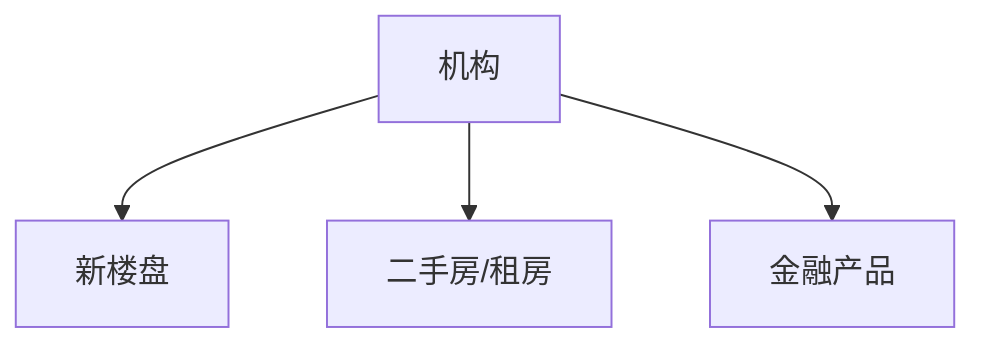
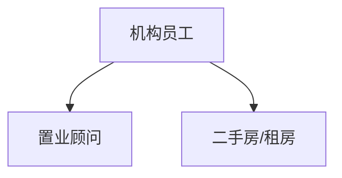
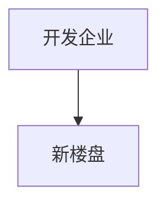
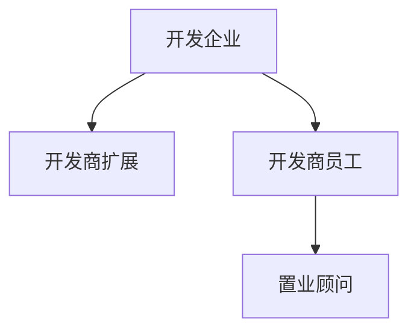
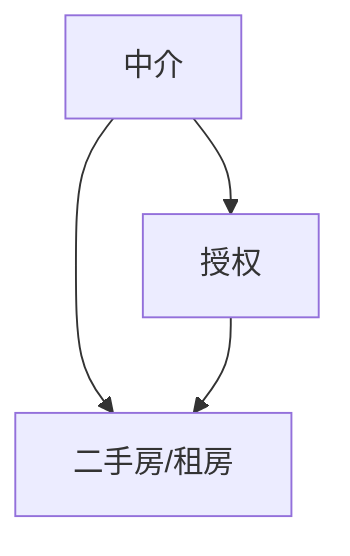
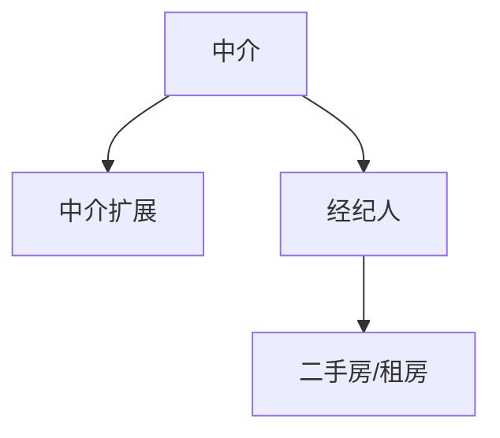
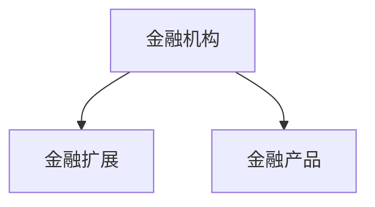

# DB跨模块关系-机构与业务

## 机构到业务

## 机构员工到业务

## 跨模块关系表

| 来源表 | 来源字段 | 目标表 | 目标字段 | 关系语义 |
|---|---|---|---|---|
| `PROPERTY_NEW_PROJECT` | `DEVELOPER_ID` | `INSTITUTION_BASE` | `ID` | 新楼盘所属开发商机构 |
| `NEW_PROJECT_CONSULTANT` | `INSTITUTION_USER_ID` | `INSTITUTION_USER` | `ID` | 新楼盘置业顾问对应开发商员工关系 |
| `PROPERTY_HOUSE_LISTING` | `INSTITUTION_ID` | `INSTITUTION_BASE` | `ID` | 二手房/租房所属机构 |
| `PROPERTY_HOUSE_LISTING` | `PUBLISHER_INSTITUTION_USER_ID` | `INSTITUTION_USER` | `ID` | 二手房/租房发布经纪人机构员工关系 |
| `PROPERTY_AUTHORIZATION` | `INSTITUTION_ID` | `INSTITUTION_BASE` | `ID` | 授权记录中的受托机构 |
| `PROPERTY_AUTHORIZATION` | `AGENT_USER_ID` | `SYS_USER` | `ID` | 授权记录中的经纪人用户 |
| `FIN_LOAN_PRODUCT` | `INST_ID` | `INSTITUTION_BASE` | `ID` | 金融产品所属金融机构 |

## 机构到新楼盘

结构口径：

- `PROPERTY_NEW_PROJECT.DEVELOPER_ID` 字段注释指向开发商扩展表。
- `INSTITUTION_DEVELOPER.INSTITUTION_ID` 指向机构主表，用于补充开发商机构基础信息。
- `NEW_PROJECT_CONSULTANT.INSTITUTION_USER_ID` 指向机构员工关系。

## 机构到二手房/租房

结构口径：

- `PROPERTY_HOUSE_LISTING.INSTITUTION_ID` 支持关联机构主表。
- `PROPERTY_HOUSE_LISTING.PUBLISHER_INSTITUTION_USER_ID` 支持关联机构员工关系。

## 机构到金融产品

结构口径：

- `FIN_LOAN_PRODUCT.INST_ID` 字段注释指向金融机构扩展表。
- `INSTITUTION_FINANCIAL.INSTITUTION_ID` 指向机构主表，用于补充金融机构基础信息。
